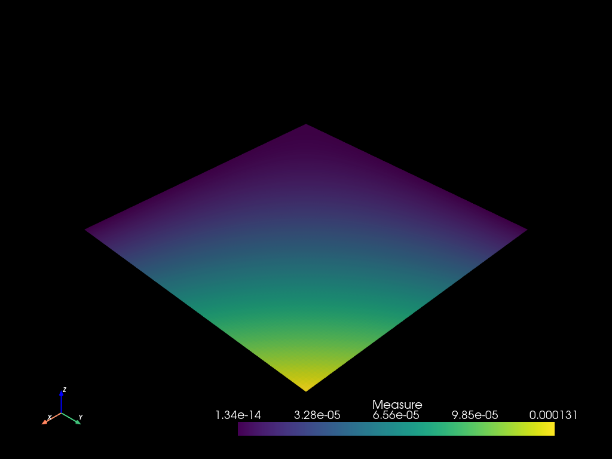
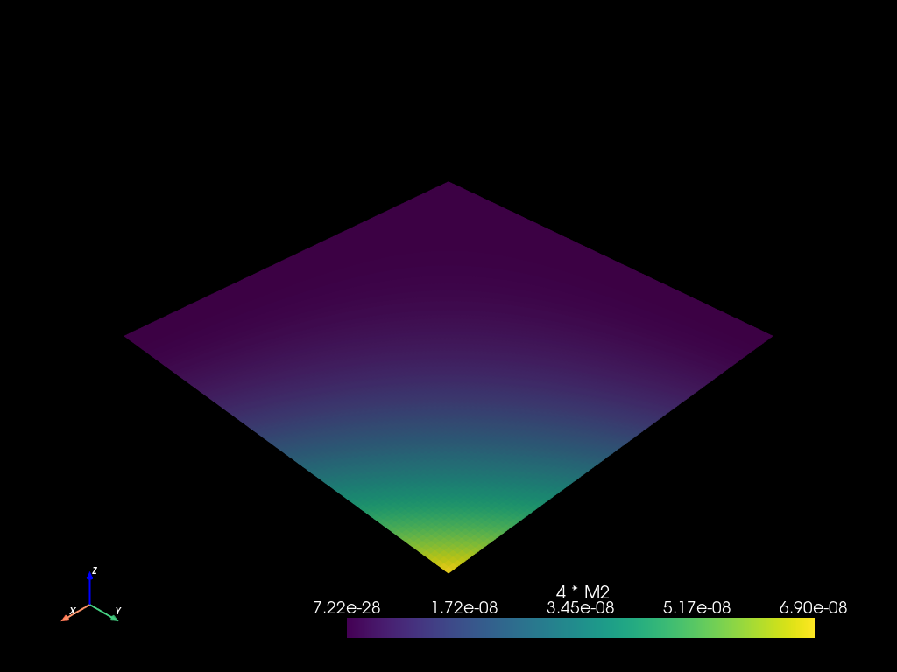
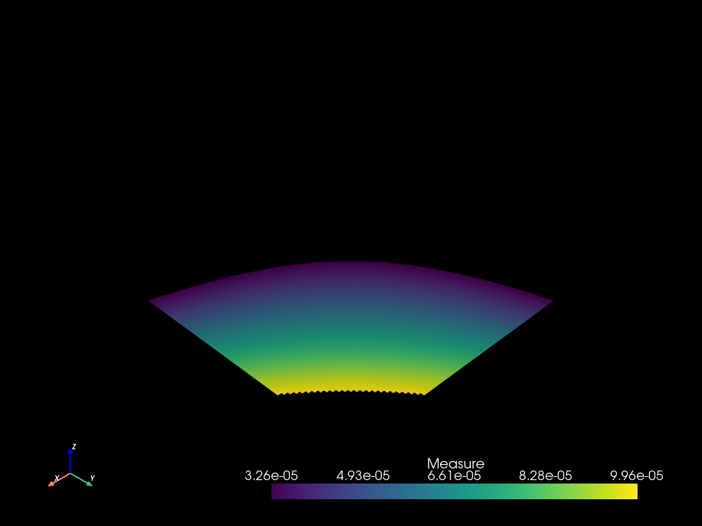
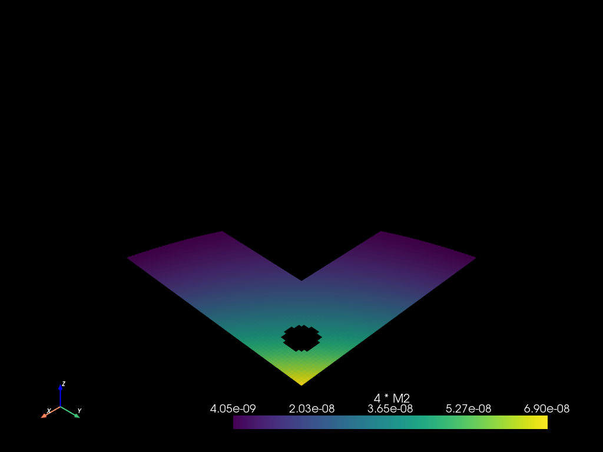

# Fields


```python
import mefikit as mf
import numpy as np
import pyvista as pv

pv.set_plot_theme("dark")
pv.set_jupyter_backend("static")
```

## Field expressions


FieldExpr are composition of floats and mf.sel.field("fieldname") or custom fields :
- field("toto") * field("tata")
- field("toto") + field("tata")
- field("toto") - field("tata")
- field("toto") / field("tata")
- field("toto") ** field("tata")
- field("toto").dot(field("tata"))
- field("toto") @ field("tata")
- sin(field("toto"))
- cos(field("toto"))
- abs(field("toto"))
- log(field("toto"))
- log10(field("toto"))
- exp(field("toto"))
- field("toto")[0]
- normals()
- x()
- y()
- z()
- centroids()


```python
x = np.logspace(-5, 0.0, 1000)
mesh2 = mf.build_cmesh(x, x)
```


```python
mesh2.measure_update()
```

## The fields mapping

Fields live in a dict-like mapping on the mesh, keyed by name. Each entry is a handle (`FieldRef`) to read values, reduce them, or write through selectors.


```python
# List and look up fields by name.
print(mesh2.fields.keys())
ref = mesh2.fields["Measure"]
print("shape:", ref.shape, "| elements:", len(ref))
```

    ['Measure']
    shape: (1,) | elements: 998001


```python
# Bulk export as {etype: array} (or a single array via `.numpy()` when the
# mesh has one element type).
vals = ref.values()["QUAD4"]
assert np.allclose(vals.ravel(), np.asarray(ref.numpy()).ravel())
```


```python
# Whole-domain reductions over every element carrying the field.
print(ref.min(), ref.max(), ref.mean())
```

    1.3435388258527605e-14 0.00013129258865784976 1.0019829640451095e-06


```python
# Regional reductions: combine a lazy selection with any field expression,
# including plain existing field names as strings.
zone = mesh2.select(mf.sel.rect([0.25, 0.25], [0.7, 0.7]))
print(zone.mean("Measure"), zone.max(mf.Field("Measure") * 4))
```

    2.542318151469843e-05 0.00025703359604145604


```python
# Writes accept scalars, arrays, field expressions or existing field names,
# targeted by wildcards (`...`) or selectors.
mesh2.fields["Scratch"] = 0.0  # create by broadcast
mesh2.fields["Scratch"][...] = "Measure"  # copy an existing field

sel = mf.sel.rect([0.0, 0.0], [0.3, 1.0])
mesh2.fields["Scratch"][sel] = mf.Field("Measure") * 2  # scaled sub-region

sample = mesh2.fields["Scratch"].values()["QUAD4"].ravel()
measure = mesh2.fields["Measure"].values()["QUAD4"].ravel()
scaled = np.isclose(sample, measure * 2) & ~np.isclose(sample, measure)
print("scaled inside:", int(scaled.sum()))
print("untouched outside:", int(np.isclose(sample, measure).sum()))

del mesh2.fields["Scratch"]  # remove it again
```

    scaled inside: 258840
    untouched outside: 739161


```python
mesh2.to_pyvista().plot()
```





```python
m = mf.Field("Measure")
```

## Field operations evaluation


```python
mesh2.fields["4 * M2"] = m * m * 4.0
```


```python
mesh2.to_pyvista().plot()
```





```python
mesh2.fields
```


    FieldsMapping(["4 * M2", "Measure"])


```python
m2 = mf.Field("4 * M2")
mesh2.eval(m2 - 4.0 * m.square())
```


    {'QUAD4': array([0., 0., 0., ..., 0., 0., 0.], shape=(998001,))}


## How does it work ?


```python
print(4.0 * m * m)
```

    BinaryExpr {
        operator: Mul,
        left: BinaryExpr {
            operator: Mul,
            left: Array(
                4.0, shape=[], strides=[], layout=CFcf (0xf), dynamic ndim=0,
            ),
            right: Field(
                "Measure",
            ),
        },
        right: Field(
            "Measure",
        ),
    }


## Why is it awesome ?

This enables two patterns :
- reusability and composition of filters
- evaluation optimizations, some selection filters are evaluated in parallel, some are evaluated first if they are discriminant

# Field to Selection

Fields can be converted to threshold selections :


```python
th = (m > 3.25e-5) & (m < 1e-4)
```


```python
m2sel = mesh2.select(th).to_mesh()
pvm2: pv.UnstructuredGrid = m2sel.to_pyvista()
pvm2.active_scalars_name = "Measure"
pvm2.plot()
```





Those threshold selections can be combined with other selections.


```python
r = mf.sel.rect([0.25, 0.25], [0.7, 0.7])
c = mf.sel.circle([0.875, 0.875], 0.05)
```


```python
mesh2.select((m2 > 4e-9) - r - c).to_mesh().to_pyvista().plot()
```



